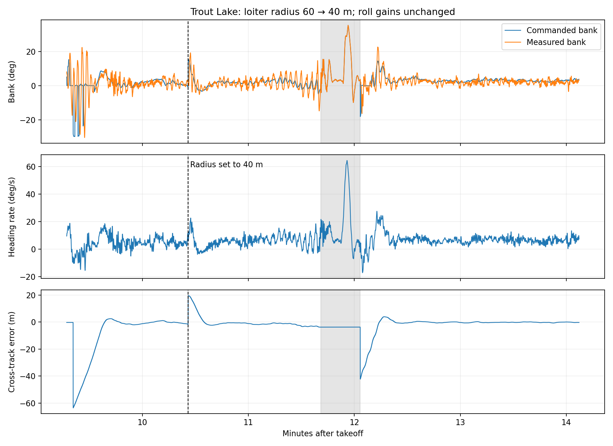

# From First Tosses to Autonomous Missions

*Micro-AGU, chapter 2 of 4 · [Start with the flight story](flight-testing.md) · [Design](micro-agu-design.md) · [Steering](paraglider.md) · [Throttle and pitch](longitudinal-observer.md) · [Data and methods](data-and-methods.md)*

The first problem with Micro-AGU was getting it into the air. At the Barrett Park RC field in Hood River, I was learning to launch a lightly loaded model while discovering what needed fixing. By the next test day at my friend Collin’s house in Trout Lake, it flew autonomous missions for nearly an hour.

Between those flights came hardware fixes, measurements, and experiments in our simple simulator. This is the sequence that made the aircraft work. The [design chapter](micro-agu-design.md) explains how an affordable HobbyKing V2 canopy and modern open-source avionics made the project practical.

| Stage | What I learned or changed |
|---|---|
| January 3, Barrett Park | Launch technique, ballast, brake trim, and the first climb/glide measurements |
| Between flights | Fixed the power-input capacitor problem and tuned lateral gains in the initial simulator |
| February 15, Collin’s house | Added payload ballast, measured trim, adjusted longitudinal control, and disabled the troublesome damper |
| Later in that flight | Tested tighter loiters, flew repeated autonomous circuits, and landed after 54.5 minutes with reserve |

## The launch was a skill I had to learn

I initially tried running with the model before tossing it. That produced some very short, unsuccessful attempts. Those logs need their field context: they were failed tosses, not useful tests of a controller in established flight.

Watching Opale Paramodels videos helped me learn a better technique. Getting the canopy inflated and overhead before releasing the model made much more sense than trying to solve the whole launch by running faster. It took practice to make that sequence repeatable. My January 3 notebook specifically calls for a “multi-step walk” and a better hand position—useful contemporary detail behind my recollection of learning to launch.

Opale’s [first-flight Backpack tutorial](https://www.youtube.com/watch?v=UEoCY5cZiRg) and [Ultra 3.5 launch demonstration](https://www.youtube.com/watch?v=Y3AK1-yno0g) illustrate the technique. Their [tutorial playlist](https://www.youtube.com/playlist?list=PLQ6f0XQ2TFqdJHD9zXCt2_ikhzftwdELU) is a useful starting point for setup and launching.

The [V2 manual](https://manuals.plus/m/cdab9dabe4a9759fe1f47d8eb9e2d012e56b482351e1acf6d5046c899579cf24) also describes a smooth overhead launch with the canopy inflated before release. [Other owners’ launch stories](https://www.rc-network.de/threads/hobbyking-paramotor-v2-luftschraube.12051592/) made the learning curve feel familiar.

## Hood River: the model was too light

My first flight, at the Barrett Park RC field in Hood River, was much too lightly loaded. Adding weight made it noticeably more stable. That was a practical lesson before it was a control-system lesson: I needed a model that flew reasonably well before asking an autopilot to improve it.

The ballast went on the **bottom of the payload**, increasing wing loading, lowering its CG, and changing its pitch inertia. The model flew noticeably better with the added weight. Opale’s [FAQ](https://www.opale-paramodels.com/gb/content/11-faq-rc-paraglider) discusses the same practical benefit of ballast for wind penetration.

My brake lines also needed loosening. The model flew nose-up and performance was disappointing: my notes recorded about 0.5 m/s climb and 0.96 m/s minimum sink. On top of that, I had omitted an electrolytic capacitor on the Matek stack power input. Bad current readings triggered false throttle power limiting. I fixed the capacitor before Trout Lake. Between loading, brake trim, and power limiting, there was plenty to sort out before tuning the controller.

*Original flight notes, notebook page 185. I also flagged the current reading, Yaapu crashes, and the need for a stronger prop guard.*

The sustained January 3 flight gives us a useful early baseline. It spent most of its time in MANUAL and FBWA, followed by brief CRUISE and LOITER trials. There is recurring pitch motion even in the longer stretches of flight.

*Hood River, January 3: height above home, payload pitch, and throttle during the sustained flight. Green marks AUTO mode.*

## Between the fields: measurements and simulation

I used both live telemetry and later Hood River log analysis to understand climb and glide performance. I also fixed the missing capacitor on the Matek power input before the next flight.

For lateral control, I used our simple initial simulation model to explore gains and damping. Mission Planner preserved the February 14 experiments and the final tuning on the morning of February 15. By 11:37 a.m. I had selected the feed-forward and derivative feed-forward values that I flew that afternoon. The [steering chapter](paraglider.md) shows the recorded tuning plots and explains the controller workaround.

## Trout Lake: another kilogram, and autonomous missions

At my friend Collin’s house in Trout Lake, I remember a short attempt or failed launch before adding another kilogram of lead to the bottom of the payload. With that weight aboard, the next flight lasted **54.5 minutes continuously on one charge**, including AUTO, LOITER, and GUIDED operation. I landed because I had finished testing.

That did not mean the controller was finished. The early part of the flight involved a lot of tuning and some substantial oscillation. Later sections became much quieter, and the repeated waypoint messages show the aircraft making progress through the mission.

*Trout Lake, February 15: tuning early in the flight, followed by quieter autonomous operation. Green marks AUTO mode.*

Early in the flight, I repeated the throttle-versus-climb testing with the heavier configuration. I first raised trim throttle from 30% to 50%, then settled on 43%. Reconstructing the early steady runs gives a level-flight crossing near 42.7%, closely matching that choice.

The pitch damper was another matter. I reduced its gain, then disabled it because the aircraft behaved better without it. I did not understand the sign error at the field. Later analysis showed how the throttle correction could reinforce the payload’s motion—the [longitudinal chapter](longitudinal-observer.md#the-damper-that-could-make-things-worse) follows that discovery.

One of the satisfying results is the later continuous AUTO segment. It lasts more than ten minutes. The recorded path shows repeated circuits, while the height and throttle traces show the controller maintaining the mission rather than simply passing through a mode switch.

*Ten minutes of AUTO: repeated circuits, height tracking, and throttle. The track origin is the start of this segment.*

## Testing tighter turns at Trout Lake

The lateral gains came from the simulator and stayed fixed throughout the long flight. I deliberately reduced the loiter-radius setting from 60 to 40 metres at 10:26 after takeoff, then to 30 metres at 35:47. The first change was in LOITER; the second was entered in GUIDED.

*The dashed line marks the 60 → 40 m radius change. Grey shading marks a brief MANUAL interval between LOITER segments. Bank and heading-rate transients are visible alongside the eventual path tracking.*

Selected settled portions of the 60 m and 40 m loiters show median heading rate increasing from about 5.0 to 6.4 degrees per second. A later 40 m segment had 0.36 m RMS logged cross-track error. That gave me a concrete result from the flight: the controller could guide the aircraft around a tighter circle, while the transitions still gave me work to do.

## What endurance did it actually achieve?

The battery choice started with a 6S Li-ion pack I already owned from GetFPV. I bought another and connected the packs in parallel because the aircraft needed weight. The motor was a cheap Amazon purchase with a roughly suitable KV, and prop diameter was constrained by the payload and packability. The [design post](micro-agu-design.md#a-battery-i-already-owned-and-propulsion-that-fit) explains that tradeoff. The result was useful endurance without a systematically optimized propulsion installation.

| Flight / segment | Duration | Charge used | Energy used | Average battery power |
|---|---:|---:|---:|---:|
| Hood River, January 3 | 12.92 min | Invalid | Invalid | Invalid |
| Trout Lake, February 15 | 54.53 min | 3.923 Ah | 84.97 Wh | 93.5 W |
| Late continuous AUTO segment, within that Trout Lake flight | 10.38 min | 0.690 Ah | 13.94 Wh | 80.6 W |

During the full flight, mean current was 4.32 A. The late AUTO segment averaged 3.99 A and 80.6 W, finishing about 10 m higher than it started.

*Trout Lake: battery voltage, current, and energy used over 54.5 minutes. Green highlights the late AUTO segment.*

The missing capacitor made Hood River’s energy figures unusable: the monitor reported 11.77 Ah and 270 Wh in 12.9 minutes from a 6 Ah battery. Its false power readings exceeded the configured 2,400 W limit for about 134 seconds. That explains why a current-sensing problem could also hurt flight performance—the watt limiter responds by reducing available throttle.

After fixing the capacitor, the capacity estimates were accurate. Trout Lake used **3.92 Ah out of 6 Ah**, leaving about **2.08 Ah, or 35%**, when I finished flying.

This was a **54.5-minute test flight with reserve**, rather than a flight to exhaustion. At the same average current, 6 Ah corresponds to about **83 minutes** of total flight time. That is an extrapolation; the flight itself demonstrated nearly an hour and ended when I was done testing.

Pack voltage fell from 24.46 V near the start of logging to 20.12 V near the end. The useful result is how much flight time came from a battery I already owned, a second pack added for weight, and inexpensive propulsion sized to fit the payload.

The [data and methods appendix](data-and-methods.md#flight-measurements) contains the measurement windows and calculations.

## What the flights left to solve

The aircraft could fly autonomous missions and tighter circles, with useful endurance. The next questions were more specific: could I control turn rate directly, and could I control climb without exciting the motion between canopy and payload?

The [steering chapter](paraglider.md) follows the first question from the roll-controller workaround to dedicated heading-rate control. The [throttle and pitch chapter](longitudinal-observer.md) follows the second from flight identification and the wrong-sign damper to an articulated model and relative-motion feedback.

[Data and methods](data-and-methods.md) records log provenance, measurement definitions, and the distinction between flight results and simulation experiments.
