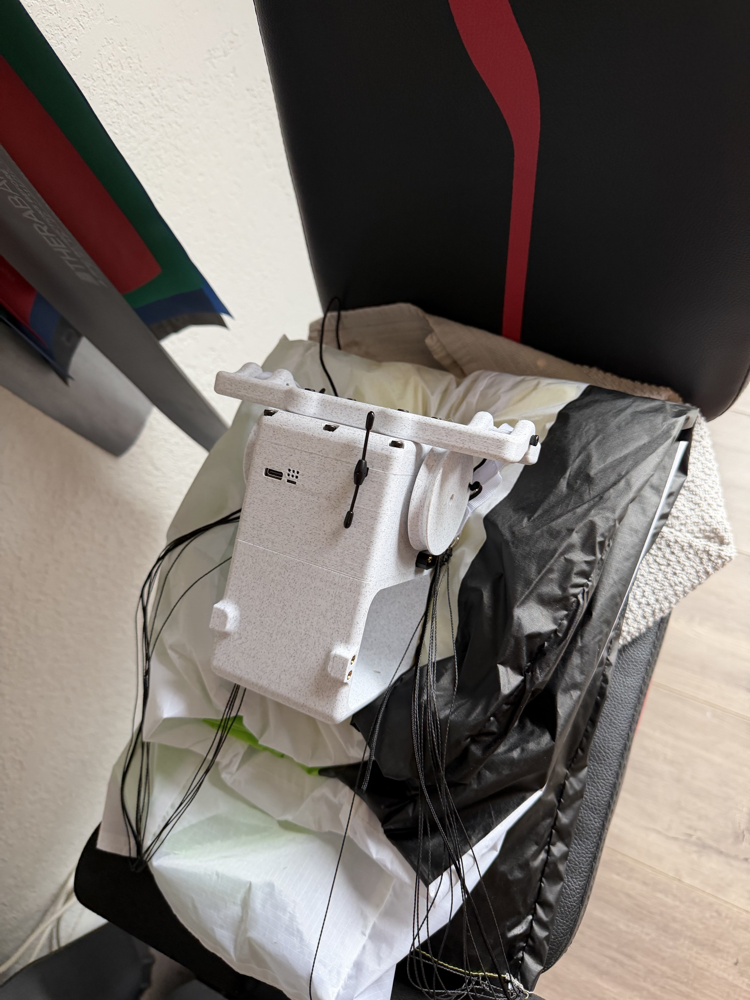
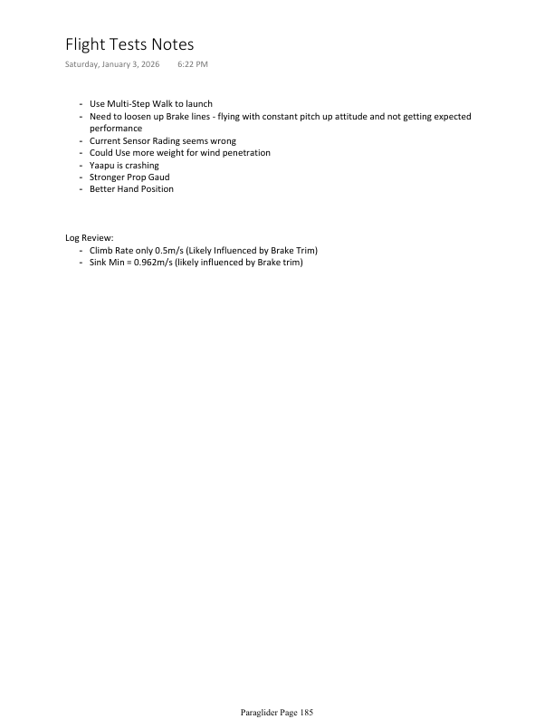
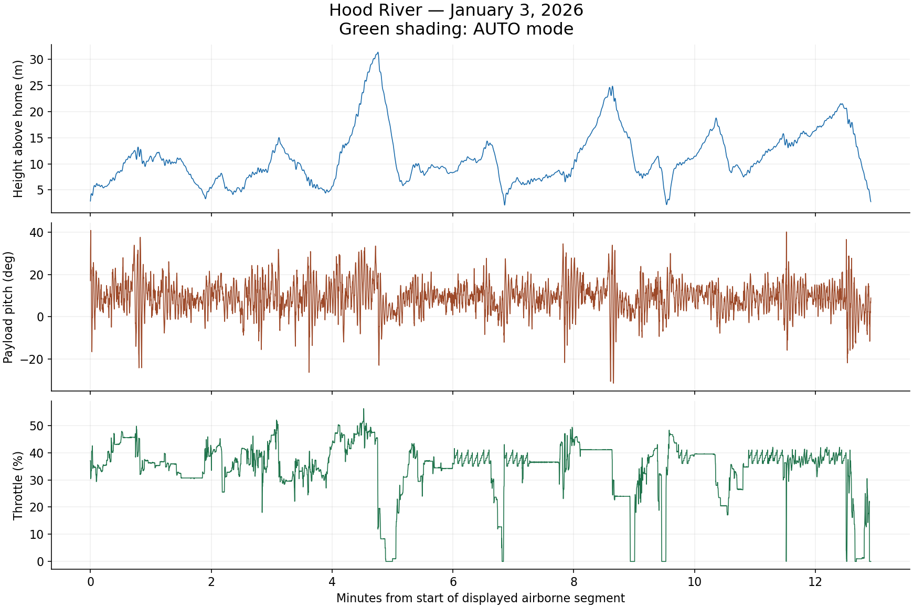
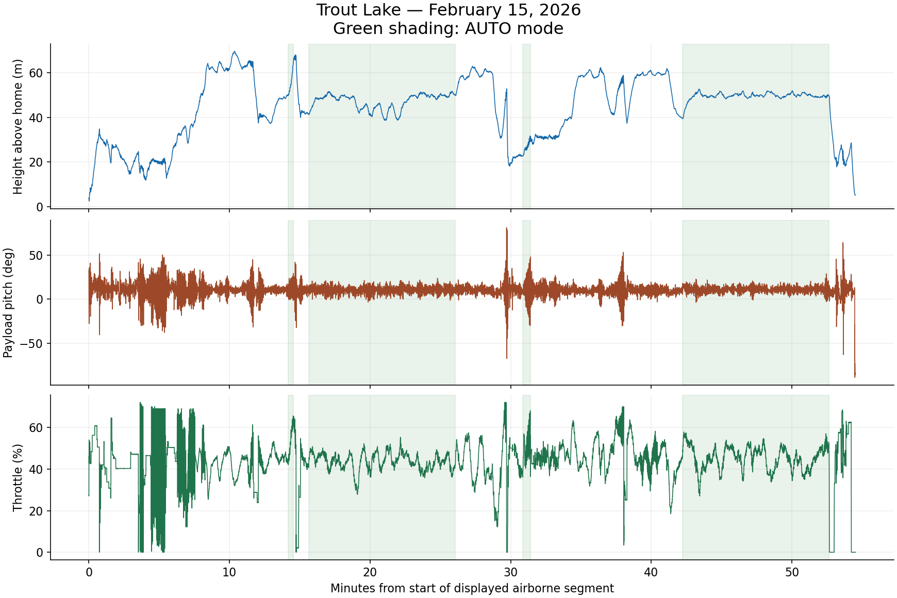
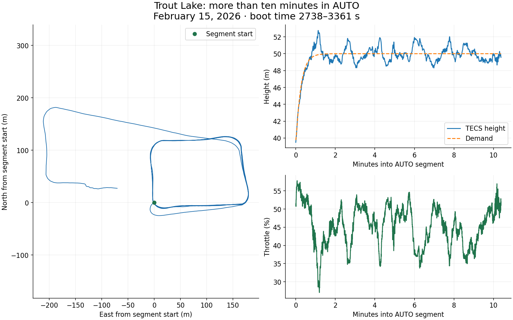
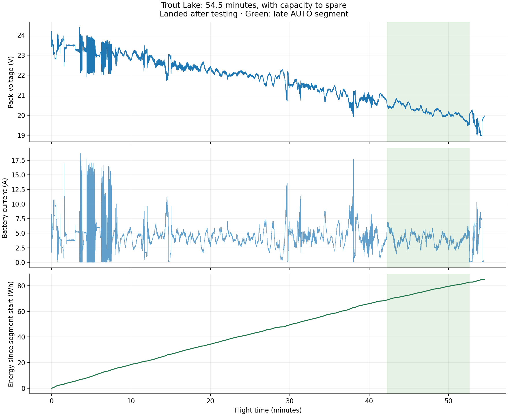
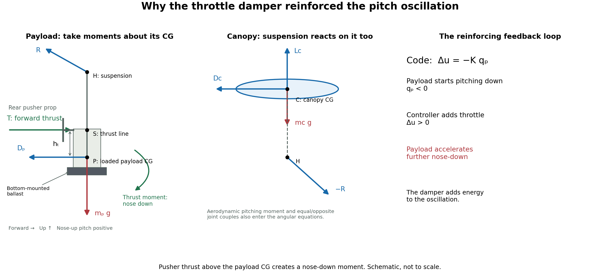
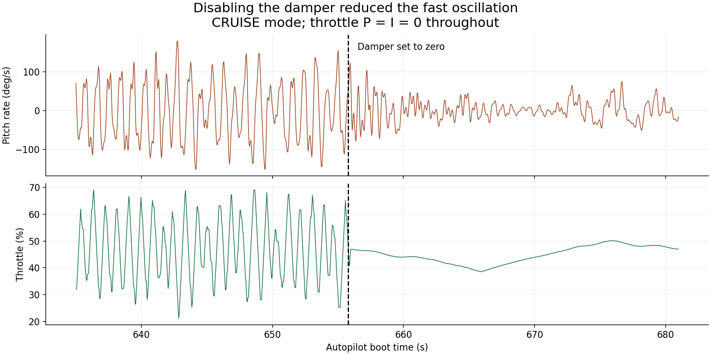

# Learning to launch, then learning to fly

The first problem with my powered model paraglider was getting it into the air. The next was keeping the controller from making it wobble.

This aircraft is part of **micro-AGU (Micro Aerial Guidance Unit)**, inspired by helping execute guided-parafoil tests at Stara Technologies in high school—mostly recovering hardware around the desert on ATVs. I wanted to explore how much better small guided parafoils could perform with modern open-source avionics. This powered test platform uses a **HobbyKing V2 canopy** and a custom suspended payload; the [design post](micro-agu-design.md) describes the hardware and original notebook. I had wanted to try this for years, but the premium canopies I considered were too expensive for the experiment and I thought the original HobbyKing wing was poor. The inexpensive V2 made the project practical.

These flight tests took me from awkward launch attempts in Hood River to sustained autonomous missions in Trout Lake. Looking back through the logs with Codex helped connect what I remembered at the field with what the aircraft actually recorded. The useful story includes the launch technique, the weight of the model, and a throttle-to-pitch response that ran against my intuition.

## The launch was a skill I had to learn

I initially tried running with the model before tossing it. That produced some very short, unsuccessful attempts. Those logs need their field context: they were failed tosses, not useful tests of a controller in established flight.

Watching Opale Paramodels videos helped me learn a better technique. Getting the canopy inflated and overhead before releasing the model made much more sense than trying to solve the whole launch by running faster. It took practice to make that sequence repeatable. My January 3 notebook specifically calls for a “multi-step walk” and a better hand position—useful contemporary detail behind my recollection of learning to launch.

Opale’s [first-flight Backpack tutorial](https://www.youtube.com/watch?v=UEoCY5cZiRg) and [Ultra 3.5 launch demonstration](https://www.youtube.com/watch?v=Y3AK1-yno0g) illustrate the technique. Their [tutorial playlist](https://www.youtube.com/playlist?list=PLQ6f0XQ2TFqdJHD9zXCt2_ikhzftwdELU) is a useful starting point for setup and launching.

The [V2 manual](https://manuals.plus/m/cdab9dabe4a9759fe1f47d8eb9e2d012e56b482351e1acf6d5046c899579cf24) also describes a smooth overhead launch with the canopy inflated before release. [Other owners’ launch stories](https://www.rc-network.de/threads/hobbyking-paramotor-v2-luftschraube.12051592/) made the learning curve feel familiar.



*The payload and folded HobbyKing V2 canopy.*

## Hood River: the model was too light

My first flight in Hood River was much too lightly loaded. Adding weight made it noticeably more stable. That was a practical lesson before it was a control-system lesson: I needed a model that flew reasonably well before asking an autopilot to improve it.

The ballast went on the **bottom of the payload**, increasing wing loading, lowering its CG, and changing its pitch inertia. The model flew noticeably better with the added weight. Opale’s [FAQ](https://www.opale-paramodels.com/gb/content/11-faq-rc-paraglider) discusses the same practical benefit of ballast for wind penetration.

My brake lines also needed loosening. The model flew nose-up and performance was disappointing: my notes recorded about 0.5 m/s climb and 0.96 m/s minimum sink. On top of that, I had omitted an electrolytic capacitor on the Matek stack power input. Bad current readings triggered false throttle power limiting. I fixed the capacitor before Trout Lake. Between loading, brake trim, and power limiting, there was plenty to sort out before tuning the controller.



*Original flight notes, notebook page 185. I also flagged the current reading, Yaapu crashes, and the need for a stronger prop guard.*

The sustained January 3 flight gives us a useful early baseline. It spent most of its time in MANUAL and FBWA, followed by brief CRUISE and LOITER trials. There is recurring pitch motion even in the longer stretches of flight.



*Hood River, January 3: height above home, payload pitch, and throttle during the sustained flight. Green marks AUTO mode.*

## Trout Lake: another kilogram, and autonomous missions

I remember a short attempt or failed launch at Trout Lake before adding another kilogram of lead to the bottom of the payload. With that weight aboard, the next flight lasted **54.5 minutes continuously on one charge**, including AUTO, LOITER, and GUIDED operation. I landed because I had finished testing.

That did not mean the controller was finished. The early part of the flight involved a lot of tuning and some substantial oscillation. Later sections became much quieter, and the repeated waypoint messages show the aircraft making progress through the mission.



*Trout Lake, February 15: tuning early in the flight, followed by quieter autonomous operation. Green marks AUTO mode.*

One of the satisfying results is the later continuous AUTO segment. It lasts more than ten minutes. The recorded path shows repeated circuits, while the height and throttle traces show the controller maintaining the mission rather than simply passing through a mode switch.



*Ten minutes of AUTO: repeated circuits, height tracking, and throttle. The track origin is the start of this segment.*

## What endurance did it actually achieve?

The battery choice started with a 6S Li-ion pack I already owned from GetFPV. I bought another and connected the packs in parallel because the aircraft needed weight. The motor was a cheap Amazon purchase with a roughly suitable KV, and prop diameter was constrained by the payload and packability. The [design post](micro-agu-design.md#a-battery-i-already-owned-and-propulsion-that-fit) explains that tradeoff. The result was useful endurance without a systematically optimized propulsion installation.

| Flight / segment | Duration | Charge used | Energy used | Average battery power |
|---|---:|---:|---:|---:|
| Hood River, January 3 | 12.92 min | Invalid | Invalid | Invalid |
| Trout Lake, February 15 | 54.53 min | 3.923 Ah | 84.97 Wh | 93.5 W |
| Late continuous AUTO segment, within that Trout Lake flight | 10.38 min | 0.690 Ah | 13.94 Wh | 80.6 W |

During the full flight, mean current was 4.32 A. The late AUTO segment averaged 3.99 A and 80.6 W, finishing about 10 m higher than it started.



*Trout Lake: battery voltage, current, and energy used over 54.5 minutes. Green highlights the late AUTO segment.*

The missing capacitor made Hood River’s energy figures unusable: the monitor reported 11.77 Ah and 270 Wh in 12.9 minutes from a 6 Ah battery. Its false power readings exceeded the configured 2,400 W limit for about 134 seconds. That explains why a current-sensing problem could also hurt flight performance—the watt limiter responds by reducing available throttle.

After fixing the capacitor, the capacity estimates were accurate. Trout Lake used **3.92 Ah out of 6 Ah**, leaving about **2.08 Ah, or 35%**, when I finished flying.

This was a **54.5-minute test flight with reserve**, rather than a flight to exhaustion. At the same average current, 6 Ah corresponds to about **83 minutes** of total flight time. That is an extrapolation; the flight itself demonstrated nearly an hour and ended when I was done testing.

Pack voltage fell from 24.46 V near the start of logging to 20.12 V near the end. The useful result is how much flight time came from a battery I already owned, a second pack added for weight, and inexpensive propulsion sized to fit the payload.

The [endurance data](assets/flight-testing/endurance-evidence.json) contains the measurement windows and calculations.

## The damper that could make things worse

I had added a pitch-rate damper to throttle. My initial intuition was that more throttle would pitch the model up, so adding throttle during a nose-down rotation should oppose that motion.

The throttle damper used:

```cpp
throttle_correction = -pitch_damping_gain * filtered_payload_pitch_rate;
```

With positive pitch rate defined as nose-up, a nose-down rotation produces a positive throttle correction. That only gives the intended damping if the relevant throttle-to-pitch response has the sign I expected.

The articulated model showed why that assumption could fail. The thrust line is below the suspension point, but above the payload CG. Forward thrust therefore produces a nose-down moment about the payload CG. The suspension point moves with the system; treating it as a fixed pivot leaves out an important part of the dynamics.



*The pusher thrust acts above the payload CG, creating a nose-down moment. The canopy and payload react through the suspension. Schematic, not to scale.*

The later analysis explained the reinforcing loop:

**Payload pitches down → controller adds throttle → payload pitches down harder.**

I did not work this out at the field. Fortunately, I decided to disable the damper while testing, and the aircraft immediately became quieter. The logs and simulation later explained why: I had designed the feedback around the wrong initial pitch response. A throttle increase can rotate the payload nose-down even while the aircraft’s longer-term response is to climb. The moving suspension and the canopy’s aerodynamic forces determine how that motion develops.

The flight data contains a particularly useful comparison. In CRUISE, I had already set the throttle P and I gains to zero. At 655.79 seconds after boot, I set the pitch damper to zero too. In the tightly bounded windows below, that was the only control setting changed.



| February 15 comparison | Boot-time window | Payload pitch-rate RMS |
|---|---:|---:|
| Damper gain 0.10; throttle P = I = 0 | 635–654 s | 76.4 degrees/s |
| Damper gain 0; throttle P = I = 0 | 659–681 s | 22.7 degrees/s |

The fast oscillation reduced sharply. Later in the same flight, reintroducing the damper at 0.05 coincided with a stronger component around 1.5 Hz; reducing it to 0.02 brought the rate RMS back down. Those observations support the self-excitation concern.

That experience led to the [longitudinal controller and observer investigation](longitudinal-observer.md). The next step is to control the relative canopy–payload motion, accounting for motor response and the different oscillation modes.

## Bringing the simulation back to the aircraft

The flights give the simulation clear targets: a slow pitch mode around 0.32–0.37 Hz and a faster oscillation excited by the damper. The articulated model captures a similar slow mode, but still needs calibration to reproduce the recorded response to throttle.

Loaded mass, CG, and inertia are the next inputs to measure. The logs record payload motion; measuring canopy motion as well would help develop the relative-pitch controller.

The progression was learning to launch, finding a weight that flew well, getting autonomous missions working, and then discovering that a plausible damping rule could reinforce the motion it was meant to suppress. The next controller should earn its bandwidth by reproducing those observations first.

## Data and methods

The figures use the January 3 and February 15 onboard logs. Height is relative to home, and the ground track is relative to the plotted segment’s starting point. Energy is battery-side electrical energy, calculated from current and voltage and checked against the onboard counters. The AUTO endurance row is part of the full Trout Lake flight.

The force diagram explains the mechanism identified afterward in the articulated model; loaded CG and inertia remain to be measured. The February 15 firmware reports `3a2da6cf`, while its parameter names match later source changes. The inspected implementations agree on the damper sign, but the version string does not identify the exact compiled tree. Filter behavior also matters: the inspected code zeros the signal at zero cutoff, applies positive cutoff changes on reset, and updates at 50 Hz using the throttle-loop timestep.

I reviewed six onboard logs and 54 telemetry logs with their raw companions. A February 22 telemetry recording switches from hardware to SITL; that simulated section is excluded here. The [flight evidence](assets/flight-testing/flight-evidence.json) records source hashes and comparison windows. [Hood River](assets/flight-testing/hood-river-plot-data.csv.gz) and [Trout Lake](assets/flight-testing/trout-lake-plot-data.csv.gz) overview data are sampled at 5 Hz; pitch-rate comparisons use the 25 Hz analysis.
