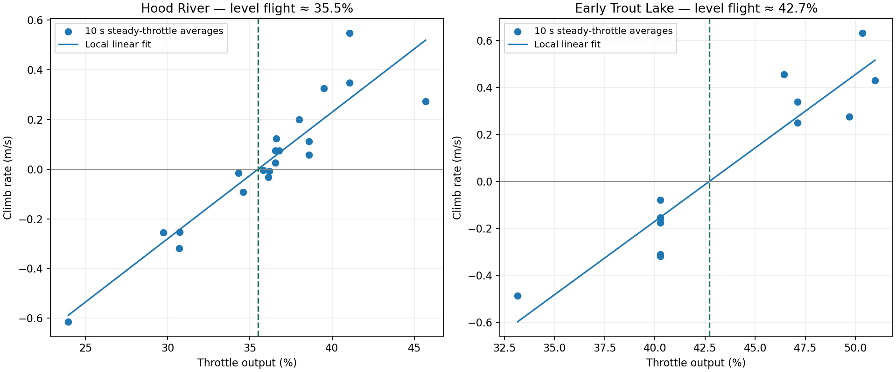
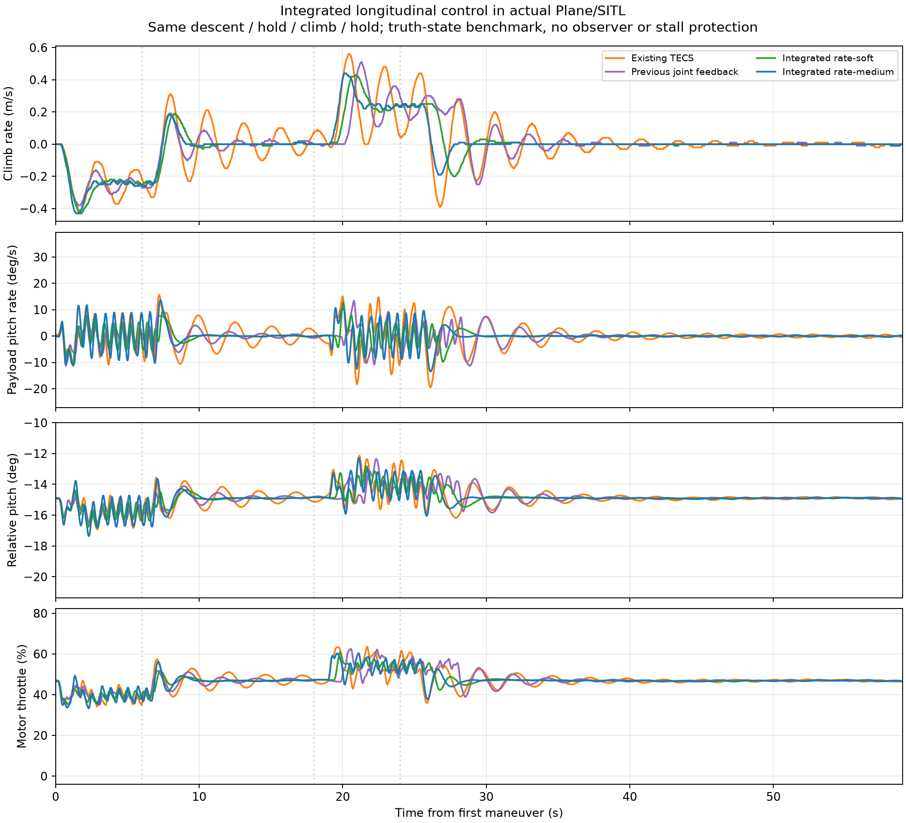
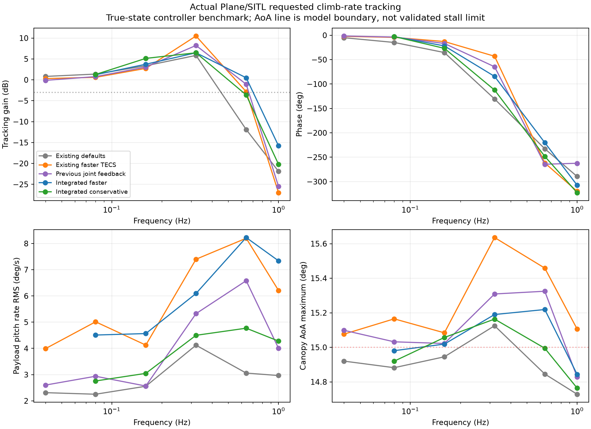

# Throttle, Pitch, and the Controller That Pushed the Wrong Way

*Micro-AGU, chapter 4 of 4 · [Start with the flight story](flight-testing.md) · [Design](micro-agu-design.md) · [Steering](paraglider.md) · [Throttle and pitch](longitudinal-observer.md) · [Data and methods](data-and-methods.md)*

I expected a throttle increase to pitch the aircraft up. That expectation went into a pitch-rate damper—and the flight exposed the mistake. Disabling it helped before I understood why. Working through the logs and the canopy–payload dynamics afterward changed how I wanted to design longitudinal control.

## Measuring what throttle could do

I used live telemetry and later Hood River log analysis to choose climb and sink settings. At the beginning of Trout Lake, I repeated the throttle tests with the heavier configuration and used level-flight testing to settle on 43% trim throttle.



*Local fits to steady 10-second MANUAL/FBWA windows put level throttle near 35.5% at Hood River and 42.7% at Trout Lake. The Hood River result includes the brake trim and false power limiting present that day.*

| Setting | Sustained Hood River flight | Trout Lake start | Trout Lake final |
|---|---:|---:|---:|
| Maximum throttle | 40% | 40% | 60% |
| Trim throttle | 30% | 30% | 43% |
| Climb limit | 2 m/s | 1.8 m/s | 1.8 m/s |
| Maximum sink | 2 m/s | 3 m/s | 3 m/s |

Early at Trout Lake I raised maximum throttle to 65% and trim to 50%, then brought them back to 60% and 43%. The climb and sink limits were already set before takeoff. I derived those limits from Hood River logs; the local steady-response fits above reconstruct the trim relationship, rather than those original limit-selection intervals.

In the paraglider TECS implementation, trim is the zero-climb baseline. Requested climb or descent interpolates throttle toward its upper or lower bound:

```text
Climbing:   throttle_ff = trim + (climb_demand / climb_limit) × (max − trim)
Descending: throttle_ff = trim + (climb_demand / sink_limit) × (trim − min)
```

The limits therefore set feed-forward slopes as well as bounding the requested vertical speed. P and I correct the remaining climb-rate error. That baseline tuning was separate from the pitch damper, which responded to angular motion.

## The damper that could make things worse

I had added a pitch-rate damper to throttle. My initial intuition was that more throttle would pitch the model up, so adding throttle during a nose-down rotation should oppose that motion.

The throttle damper used:

```cpp
throttle_correction = -pitch_damping_gain * filtered_payload_pitch_rate;
```

With positive pitch rate defined as nose-up, a nose-down rotation produces a positive throttle correction. That only gives the intended damping if the relevant throttle-to-pitch response has the sign I expected.

The articulated model showed why that assumption could fail. The thrust line is below the suspension point, but above the payload CG. Forward thrust therefore produces a nose-down moment about the payload CG. The suspension point moves with the system; treating it as a fixed pivot leaves out an important part of the dynamics.


*The pusher thrust acts above the payload CG, creating a nose-down moment. The canopy and payload react through the suspension. Schematic, not to scale.*

The later analysis explained the reinforcing loop:

**Payload pitches down → controller adds throttle → payload pitches down harder.**

I did not work this out at the field. Fortunately, I decided to disable the damper while testing, and the aircraft immediately became quieter. The logs and simulation later explained why: I had designed the feedback around the wrong initial pitch response. A throttle increase can rotate the payload nose-down even while the aircraft’s longer-term response is to climb. The moving suspension and the canopy’s aerodynamic forces determine how that motion develops.

The flight data contains a particularly useful comparison. In CRUISE, I had already set the throttle P and I gains to zero. At 655.79 seconds after boot, I set the pitch damper to zero too. In the tightly bounded windows below, that was the only control setting changed.


| February 15 comparison | Boot-time window | Payload pitch-rate RMS |
|---|---:|---:|
| Damper gain 0.10; throttle P = I = 0 | 635–654 s | 76.4 degrees/s |
| Damper gain 0; throttle P = I = 0 | 659–681 s | 22.7 degrees/s |

The fast oscillation reduced sharply. Later in the same flight, reintroducing the damper at 0.05 coincided with a stronger component around 1.5 Hz; reducing it to 0.02 brought the rate RMS back down. Those observations support the self-excitation concern.

That experience made relative canopy–payload motion the next control question, along with motor response and the different oscillation modes.

## Modeling the moving suspension

The damper problem made canopy–payload coupling central: the longitudinal canopy/payload hinge was tricky, and my throttle pitch damper caused enough self-excitation that I zeroed it out. My thrust line is below the hinge, with the CG below that. I asked us to add the joint to SITL and investigate the coupling before the flight logs were available.

The optional pitch joint we implemented separates canopy and payload pitch, with coupled inertias, translation and thrust moment. The payload IMU acceleration includes the moving lever-arm contribution. Roll/yaw remain shared; this is not a complete multibody parafoil model. Representative settings are total mass 1.55 kg, canopy 0.19 kg, payload 1.36 kg, inertias 0.025/0.03 kg m² and joint damping 0.015 N m per rad/s. The payload CG is 0.35 m below the hinge. The modeled thrust line is 0.10 m above that CG, hence still 0.25 m below the hinge.

Pitch-sign conventions and aerodynamic blending were corrected during the experiments. Earlier directories explicitly marked before the aero-sign correction are historical results. The 15-degree linear-aerodynamic boundary and high-angle blend are numerical approximations, not a validated stall or collapse envelope.

The native `ParagliderPitchJoint` test and 20 model unit tests passed; the rigid-model extended AUTO test remains part of normal coverage. Local articulated AUTO runs completed, but those use different configurations and should not be pooled with lateral comparisons. [Physics review](../scratch/paraglider-tests/pitch-joint/physics-review/summary.json) records the model assumptions and trim analysis.

## From damping to relative-motion control

The longitudinal problem I want to solve is how to use as much control bandwidth as possible without stalling the canopy or driving the canopy and payload into large oscillations. After the flight evidence and articulated-model analysis, I was not convinced that motion-profile limiting alone would get me the performance I wanted. I suspected the controller needed some awareness of the relative angles and rates.

Before taking on an observer, I asked us to try controllers that could read the simulated joint state directly. That gave us a way to ask whether the information was useful at all, and what remained difficult even with perfect access to it. These local truth-state prototypes are research; they are not included in the durable ArduPilot branch.

## First, test whether joint-state feedback helps

We first kept TECS and added canopy/payload rate feedback ahead of motor lag, working through 44 trials. A useful correction was approximately `Δthrottle = -0.56 q_canopy + 0.16 q_payload`, with rates in rad/s. In a matched faster-TECS case, payload pitch-rate RMS fell from 4.69 to 2.95 deg/s. Relative-rate information supplied most of the benefit; matched payload-only feedback achieved 5.02 deg/s. This reduced oscillation but did not demonstrate a large usable bandwidth increase.

I then asked us to try a controller update that treated the longitudinal system more directly. We tested integrated longitudinal control in a subsequent 21-trial study. Strong direct-throttle LQI gains became unstable with actuator timing/slew. The final conservative prototype commands throttle rate at 50 Hz, including motor lag, command state, saturation and conditional integral antiwindup. Its states include payload pitch, relative angle/rate, payload rate, air-relative velocity, motor throttle, previous command and climb-error integral.

| Matched step case | Climb tracking RMS | Payload rate RMS | Settling time |
|---|---:|---:|---:|
| Faster TECS baseline | 0.12851 m/s | 4.6922 deg/s | 12.04 s |
| Prior joint feedback | 0.09708 m/s | 2.9541 deg/s | 5.46 s |
| Conservative integrated | 0.07978 m/s | 2.3915 deg/s | 2.70 s |
| Faster integrated | 0.07123 m/s | 3.5172 deg/s | 2.20 s |



The conservative setting was encouraging: it also improved rate RMS in zero-joint-damping, slower-motor and shifted-thrust-line checks. The severe gust cases showed how much work remained: about 38 deg/s rate RMS and angles of attack outside the calibrated model. At 0.32 Hz the whole-loop gain peak fell from 3.35 to 2.11, with more phase lag; the height outer loop still amplified the inner response. This is not proof of a safe high-bandwidth controller.



A local native AUTO course completed in 1103.6 s with maximum corner overshoot 1.079 m. It used an **airborne preparation fixture**, not a normal launch, and reached 20.16 degrees modeled angle of attack. Course assertions passing therefore do not establish stall protection.


[Integrated summary](../scratch/paraglider-tests/pitch-joint/integrated-control/summary.json), [validation](../scratch/paraglider-tests/pitch-joint/integrated-control/validation.json), [oracle study](../scratch/paraglider-tests/pitch-joint/oracle-control/summary.json) and archived scripts provide provenance. Production sources/binaries were restored after these local trials. A payload-pitch transfer had a right-half-plane zero, while the CG climb transfer did not; inverse pitch response alone does not prove a fundamental climb-bandwidth limit.

## Can I estimate what I cannot measure?

The next question was how to get relative pitch information without a hinge-angle sensor. I asked us to assess observability with and without airspeed, rather than assuming an observer would work.

The nominal nine-state linearization we assessed uses payload pitch, relative pitch, payload/relative rates, two air-relative velocity components, motor state and horizontal/vertical wind. With a known model and constant wind, the local PBH assessment gives rank nine with attitude/gyro/GNSS measurements, with or without a pitot sensor. This nominal result is weaker than it sounds: modeling unknown constant force/moment biases adds ambiguous modes.

With four independent constant acceleration/angular disturbances, the thirteen-state assessment gives zero-frequency PBH rank ten without airspeed and eleven with scalar airspeed: respectively three and two unobservable constant directions. This deliberately permissive bias model exposes ambiguity rather than asserting those biases are a physical plant. Relative rate appears more useful than absolute relative angle; a scalar pitot does not measure airflow direction or vertical wind.

I also questioned whether we needed raw IMU data when ArduPilot already has an AHRS interface. Checking those interfaces clarified what is available and where the lever-arm correction still belongs. AHRS gyro is corrected payload angular rate. AHRS earth-frame acceleration is bias-corrected specific force at the IMU, not automatically translated to the payload CG. The corrected delta-velocity interface includes gravity but likewise does not supply that moving-origin correction. EKF navigation position/velocity handle configured rigid-body IMU lever arms; canopy articulation still requires its own geometry. A practical observer should predict specific force at the actual sensor position and use AHRS correction rather than duplicating calibration or differentiating noisy gyro. AHRS/IMU-derived measurements also have correlated errors.

[Assessment script](../scratch/paraglider-tests/pitch-joint/observer-design/assess.py) and [ranks/results](../scratch/paraglider-tests/pitch-joint/observer-design/assessment.json) are archived. No flight-ready observer or reliable absolute-angle limiter has been implemented.

## How much model identification can we avoid?

Finally, I wanted to revisit the free-body diagram. If this eventually needs to work on a variety of platforms, every inertia, mass and aerodynamic coefficient we ask a user to identify is a practical obstacle. We looked for terms that cancel and ratios that can replace absolute values.


Let `R` be suspension force on the payload, `T` forward thrust, `Dp` payload aerodynamic force, and `fp = ap - g` payload-CG specific force. Define `τ = T/mp`, `dp = Dp/mp`, `κp = Ip/mp`, `κc = Ic/mp`, and `ma = Ma/mp`. Vectors `a` and `b(δ)` run from the hinge to payload and canopy CG in one frame; `zT` is the signed thrust moment arm using the diagram convention.

The payload force balance yields:

```text
R/mp = fp - τ ex - dp
```

Adding payload and canopy pitch equations cancels their equal-and-opposite internal hinge torque:

```text
κc q̇c + κp q̇p = [(b-a) × (fp-τ ex-dp)]y + zT τ + ma
s = κc qc + κp qp
ṡ = [(b-a) × (fp-τ ex-dp)]y + zT τ + ma
qrel = (s-κp qp)/κc - qp
```

This removes the explicit joint stiffness/damping law from the summed momentum propagation and replaces canopy lift/drag force modeling with measured suspension loading. Uniform gravity cancels when translation is eliminated. Absolute mass can be reduced to inertia/mass ratios; `κc = (mc/mp) kc²` if `kc` is canopy radius of gyration. Scaling lengths by a reference suspension length and time by `sqrt(L/g)` improves numerical conditioning.

**The external canopy pitching moment `Ma` does not cancel.** Geometry, inertia ratios, thrust-per-mass/moment arm, payload drag and residual canopy moment still require modeling. Integrating the summed momentum without measurement correction drifts; this cancellation is not a complete observer and does not solve initial-state identifiability. My next step would be to benchmark an uncertainty-aware relative-rate observer against simulation truth, then test control with confidence-dependent limits and recorded flight data. The experiments give me a reason to pursue relative-rate feedback, but they have not yet answered how reliably I can estimate absolute canopy angle or protect the wing at the bandwidth I want.

The [data and methods appendix](data-and-methods.md) collects the parameter chronology, measurement windows, firmware caveat, and simulation provenance.
