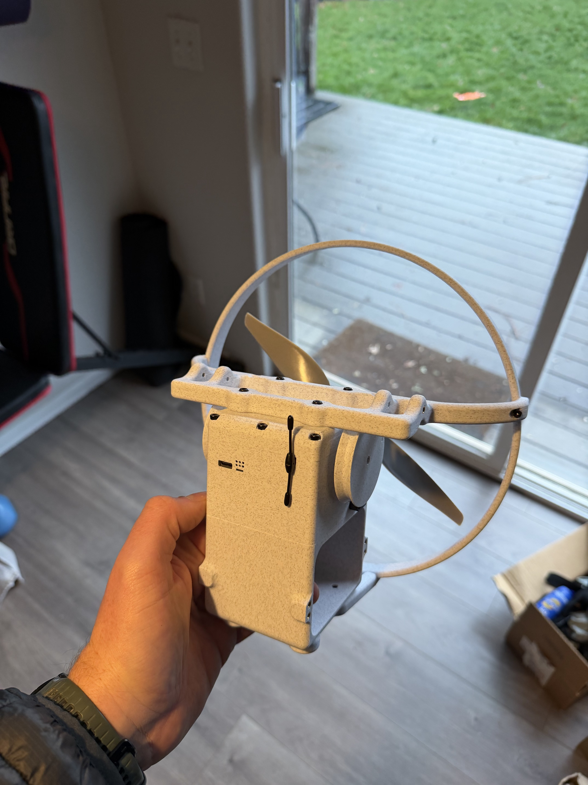
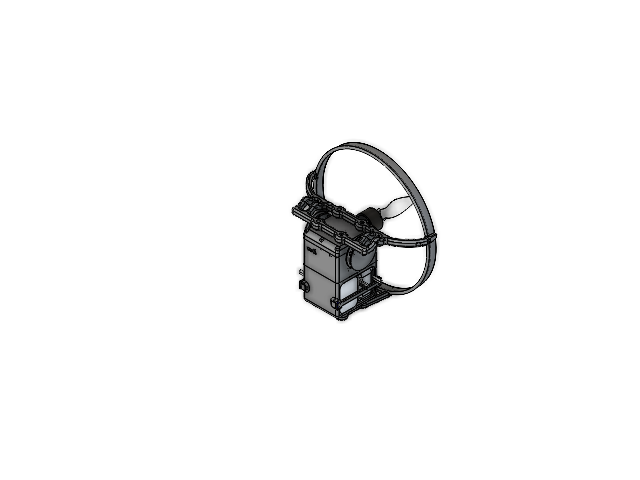
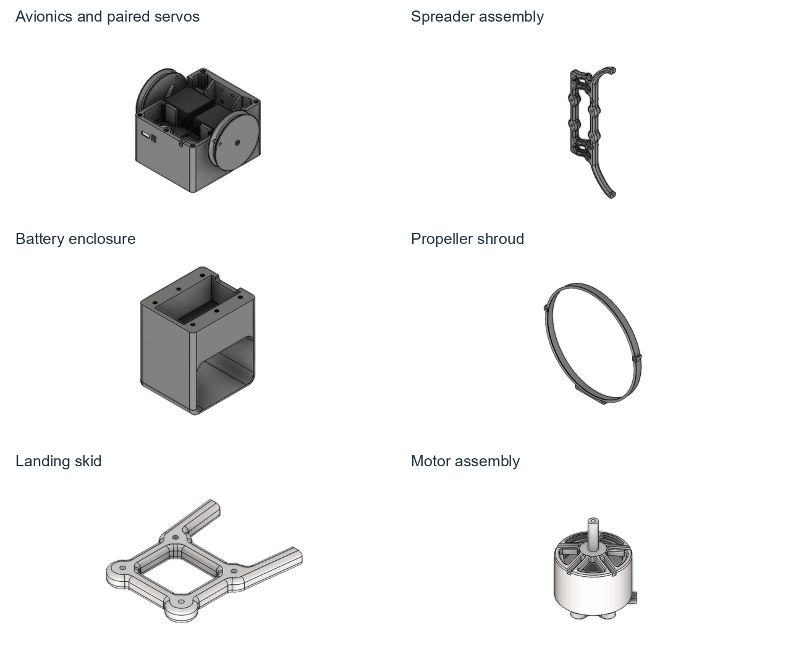
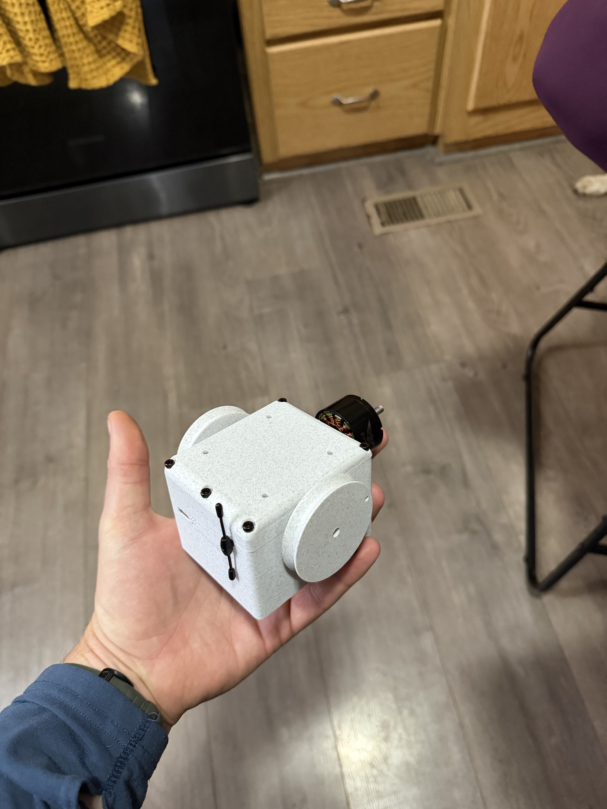
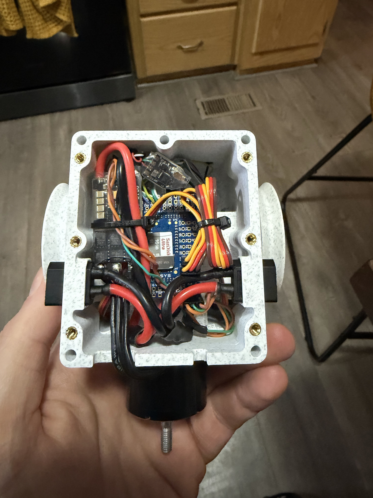
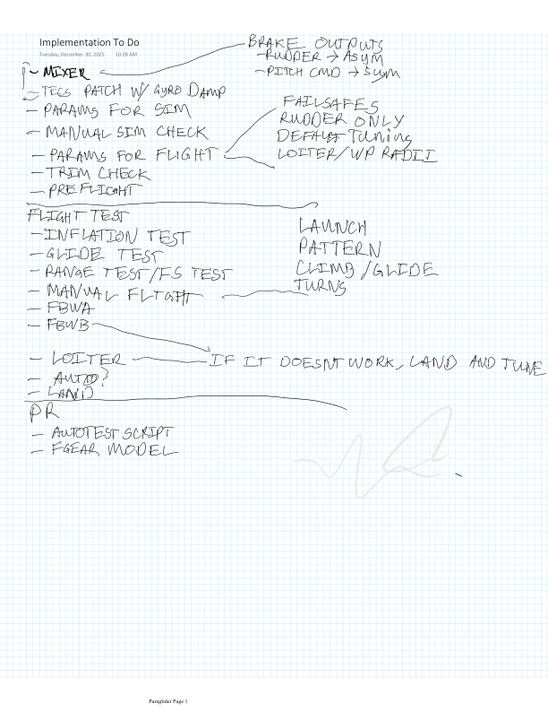

# Micro-AGU: returning to small guided parafoils

My interest in guided parafoils started in high school, when I helped with test execution at Stara Technologies. My role was mostly test support: roaming around the desert on ATVs, recovering hardware after test flights, and picking up the pieces.

Stara was developing miniature autonomous parafoil systems. A [2002 company announcement](https://guidedparafoils.org/wp-content/uploads/2019/10/ProQuestDocuments-2019-10-06.pdf) describes a guidance unit weighing just over half a pound, combining GPS, a compass, and motor-driven steering under a small parafoil. Its later [Mosquito system](https://www.spacewar.com/reports/STARA_Technologies_Demos_UAV_Precision_Airdrop_Capabilities_For_US_Military.html) pursued precision delivery of small payloads from unmanned aircraft. I was helping execute tests, not designing those guidance systems, but the idea stayed with me.

I'd wanted to try a project like this for years. The higher-end Opale and Hacker canopies cost more than I wanted to spend on an experiment, and I thought the original HobbyKing canopy was pretty bad. The inexpensive V2 canopy changed that: it made the experiment practical. Modern open-source avionics supplied the other key ingredient.

That became **micro-AGU—Micro Aerial Guidance Unit**: an opportunity to explore how much better a small guided parafoil could perform with modern open-source avionics.

*The assembled payload, with its battery compartment open.*

The powered paraglider gives me a repeatable way to fly the guidance hardware, collect data, and study the interaction between the canopy, payload, and controller. The longer-term goal is a small autonomous guided parafoil.

This post brings together the physical design, my original notebook, and what the early flights taught me. The [flight-test story](flight-testing.md) covers the launches, ballast changes, autonomous missions, and pitch-damper trouble in more detail.

## A commercial canopy and a custom payload

The canopy is a **HobbyKing V2**, a 2.4 m single-skin wing. [HobbyKing redesigned the wing and improved the suspension lines](https://hobbyking.com/en_us/h-king-paramotor-v2-w-led-light-bar-2400mm-pnf.html), with testing and feedback from JohnVHRC. Those changes made V2 worth trying.

The affordability mattered more than having a premium wing. The [Opale](https://www.opale-paramodels.com/gb/rc-paramotor-paraglider-wing/1739-ultra-35.html) and [Hacker](https://www.hacker-motor-shop.com/Para-RC/Para-RC-gliders.htm?a=catalog&p=7836&shop=hacker_e) canopies I had considered cost more than I wanted to spend on the experiment.

*The commercial canopy and the custom payload together. Line routing and brake neutral are part of the integration work.*

HobbyKing recommends 1.6–2.0 kg for its stock paramotor, with heavier loading for windier conditions. My custom payload packages the avionics, brake actuators, batteries, motor, propeller guard, and landing structure.

*The payload assembly in SolidWorks.*

The assembly divides the hardware into recognizable subassemblies. A central core contains the avionics and paired servo mechanisms. A separate battery enclosure sits below it. The spreader structure, motor and shroud, and skid complete the package. That arrangement makes the aircraft's mechanical layout part of the control problem: thrust, suspension forces, and the mass of the lower payload act at different places.

*Avionics, spreader, battery enclosure, shroud, skid, and motor subassemblies.*

The component tree fills in details that are difficult to see in the overall preview:

| Subsystem | What the saved design contains |
|---|---|
| Brake actuation | Two instances of `ServoAssembly`, each containing a `DS339HV`, a servo horn, and a control arm |
| Avionics | `AutoPilot`, `USBBoard`, and `ESC` components within the core assembly; an `M10Q-5883` component in the main assembly |
| Propulsion | A `3115Motor` assembly, separate rotor and stator models, and an `APC 9x6 CW` propeller model |
| Battery packaging | Two instances of `Nav6S300Lion` in `BatteryBoxAssm`, plus two battery gates in the main assembly |
| Structure | Spreader assembly, core block, top block, battery enclosure, propeller shroud, and skid |

The CAD and build photographs show the configuration flown at Trout Lake. The avionics use a Matek H743 flight controller, and the two 6S Li-ion packs are connected in parallel for 6 Ah total capacity.

*The core before the surrounding frame and propeller guard are fitted; a useful sense of scale.*

*Inside the core: flight controller, power electronics, and brake-servo wiring.*

## A battery I already owned, and propulsion that fit

I already had a 6S Li-ion pack bought from GetFPV for an earlier project, so I built around it. When the aircraft needed more weight, I bought a second pack and connected them in parallel: 6S2P at the pack level, keeping the voltage and adding capacity. That let some of the required mass carry useful energy, although the later lead ballast was still necessary.

The motor was an inexpensive Amazon purchase with a KV close enough for the job. Propeller diameter was a hard constraint imposed by the payload design and my desire to keep it packable. The build uses the 3115 motor and APC 9×6 CW propeller shown in the CAD. I chose a propulsion system that fit the project rather than designing the whole aircraft around maximum endurance.

The two packs provide **6 Ah total at 6S**, roughly 130 Wh of nominal energy. At Trout Lake they powered a continuous **54.5-minute flight**, using about **85 Wh**. I landed because I had finished testing, with capacity still available. The [flight post](flight-testing.md#what-endurance-did-it-actually-achieve) breaks down the results.

## Two brake channels, and an airplane autopilot to adapt

The December 30, 2025 implementation checklist starts with the mixer: roll command to asymmetric brake output, pitch command to symmetric brake output. It also calls for a TECS patch with a gyro damper, simulation parameters, manual simulation checks, flight parameters, and trim checks.

*The December 30 implementation and flight-test checklist.*

That checklist captures the adaptation I was trying to make. ArduPilot supplied an existing navigation and flight-control framework, but the parafoil's controls needed different interpretation. The brake mixer was one piece. The relation between throttle and payload pitch was another, and eventually the source of a much less intuitive problem.

The [V2 manual](https://manuals.plus/m/cdab9dabe4a9759fe1f47d8eb9e2d012e56b482351e1acf6d5046c899579cf24) describes one brake for turning and both brakes for the up-elevator command. [JohnVHRC demonstrates the mixing](https://www.youtube.com/watch?v=OqNvJ_UtPqc&t=480s) and line setup. I needed to establish the neutral position and travel for my own brake mechanisms.

The same page lays out a progression through inflation and glide tests, range and failsafe checks, manual flight, FBWA/FBWB, and then LOITER and AUTO. Launch, pattern work, climb/glide, and turns were all on the list. The notebook's January 30 control-law sketches return to the lateral loop, comparing the standard ArduPlane structure with the paraglider approach. These notes connect the physical build to the later [turn-control and simulation work](paraglider.md).

My notebook also collects research on small paramotor guidance, longitudinal dynamics, and autonomous flight alongside my own sketches and test notes.

## What the first flight sent back to the design

The January 3 flight notes are more specific than my memory of a difficult launch day. They call for a multi-step walk to launch, a better hand position, a stronger prop guard, and more weight for wind penetration. They also say the brake lines needed loosening: the model was flying with a persistent nose-up attitude and was not giving the performance I expected.

*January 3 flight notes: launch technique, brake trim, weight, and hardware fixes.*

I recorded about 0.5 m/s climb and 0.96 m/s minimum sink, and suspected the tight brake lines were hurting performance. There was an electrical problem too: I had left out an electrolytic capacitor on the Matek stack power input. The resulting bad current readings triggered false throttle power limiting. I fixed that before Trout Lake.

The hardware implications were direct. The shroud and skid had to work during awkward handling and landings. The brake mechanism needed usable travel and correct neutral trim. The instrumentation needed to be trustworthy before its numbers could support a performance claim. Autonomous flight did not remove those requirements.

## Ballast belongs in the mechanical model

The early Hood River configuration was too light. Adding ballast improved its behavior. At Trout Lake we added another kilogram of lead and went on to fly successful AUTO missions.

The ballast was attached to the **bottom of the suspended payload**, not to the canopy. That distinction matters. It increased the weight carried by the same wing and shifted the payload CG downward; it also changed the payload's pitch inertia. Adding it cannot be represented faithfully by increasing canopy mass in the simulation.

The bottom-mounted ballast makes the thrust-line question especially relevant. In the articulated model, thrust above the payload CG produces a direct nose-down moment, even though the motor sits below the suspension. A pitch-rate damper designed around the opposite initial response can reinforce the motion. The [flight-test post](flight-testing.md) shows the force diagram and the log segment where disabling the damper sharply reduced the oscillation.

The next simulation work needs the loaded mass, CG, inertia, suspension geometry, and brake settings. Measuring those will help the model reproduce the motion recorded in flight.

## What better performance will mean

The motivation remains the same as when I started: see what modern open-source avionics can do for a small guided parafoil. The early results establish that this powered platform can fly sustained autonomous missions. They also show why a working mission is only the beginning of the evaluation.

A useful comparison needs a recorded configuration and repeatable conditions. Guidance accuracy, wind handling, trim, and the canopy–payload motion all belong in that evaluation. For now, the design, flight data, and [longitudinal-controller investigation](longitudinal-observer.md) give me a way to identify what to measure and what to improve next.

## Design record

The design record includes my notes on pages 1, 185, and 323 of `Paraglider.pdf`, the SolidWorks files, build photographs, and flight logs. The [design evidence](assets/micro-agu/design-evidence.json) records the assembly structure and source hashes. CAD previews were extracted with [SWFormat](https://github.com/KenM76/swformat).