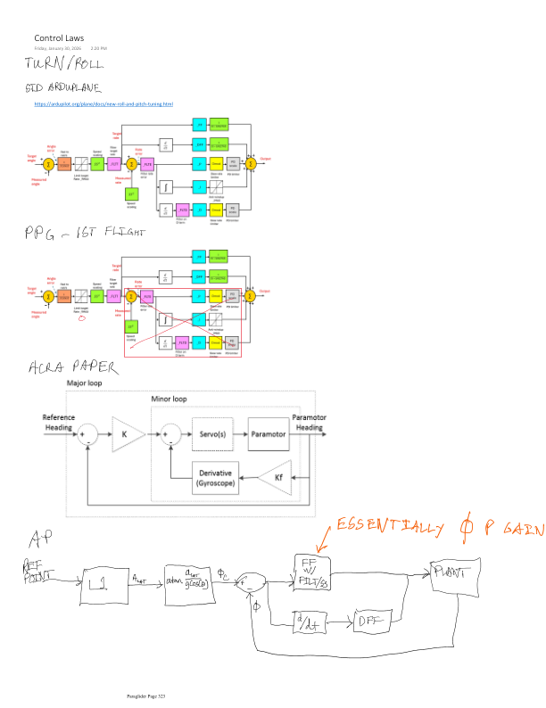
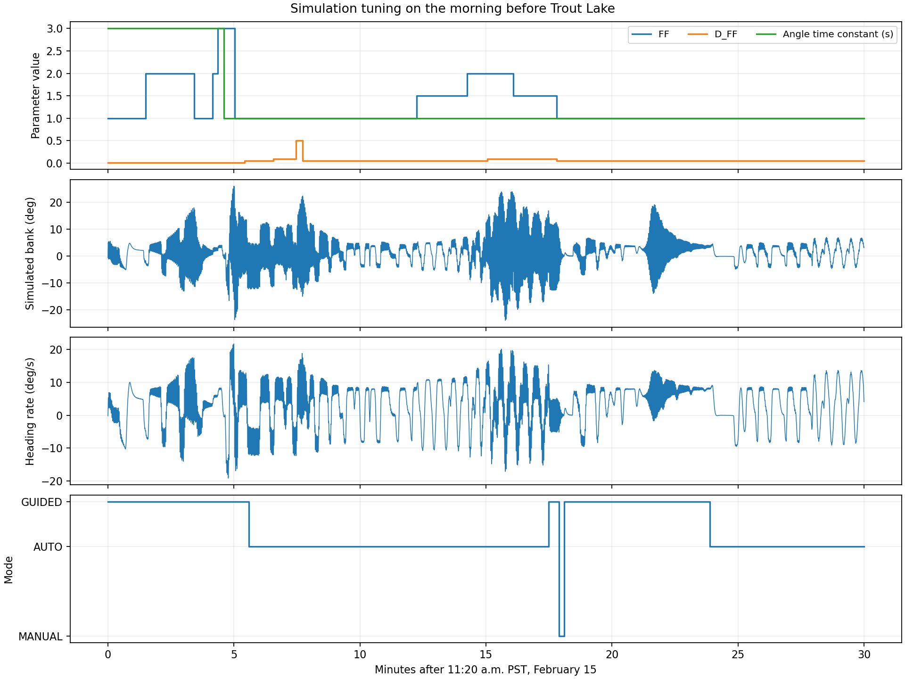
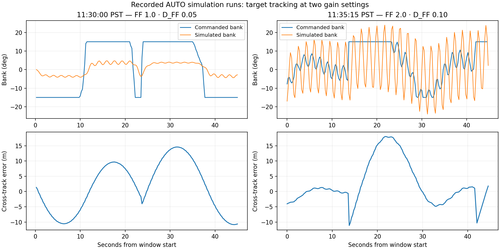

# Steering a Parafoil with an Airplane Autopilot

*Micro-AGU, chapter 3 of 4 · [Start with the flight story](flight-testing.md) · [Design](micro-agu-design.md) · [Steering](paraglider.md) · [Throttle and pitch](longitudinal-observer.md) · [Data and methods](data-and-methods.md)*

I initially thought I would need to design a yaw-rate controller for the parafoil. Differential braking makes it turn, so controlling the rate of that turn seemed more natural than asking an airplane roll controller to do the job. I wanted to keep ArduPlane's navigation and replace the part that translated its demands into brake movement.

As I worked through my notes, I figured out that I could get much of the same behavior by changing the gains in the controller that was already there. The trick was to turn off the inner roll-rate feedback and use its feed-forward path as an angle gain. With bank angle standing in for turn rate, that gave me a practical route to the first flights without writing the new controller immediately.

The flights got me to working autonomous missions. Thinking through the flight behavior afterward and testing the loops in simulation brought me back to the original idea: a dedicated turn-rate controller would make the response easier to tune and the achievable turns easier to express. The [flight-test post](flight-testing.md) covers the aircraft tests; this page follows that progression in the lateral controller.

## Getting the first controller by changing the gains

I started by breaking ArduPlane's roll controller into its individual paths. It normally converts bank-angle error into a requested roll rate, then uses rate feedback and feed-forward to drive the ailerons. I crossed out the rate P, I, and D paths and followed what was left. The feed-forward path reduced to something much simpler: essentially a proportional gain on bank-angle error.



*January 30 control-law notes: keep the navigation and angle-error calculation, then use rate feed-forward to drive the brakes.*

A conventional airplane roll controller has two nested loops. Bank-angle error creates a requested roll rate, then a rate controller drives the ailerons. For my parafoil, the output instead goes through the brake mixer. Differential braking produces a turn and the associated bank, so I wanted a simple angular correction rather than an inner loop tuned around aileron-driven roll dynamics.

Let φ_cmd be commanded bank, φ be measured bank, τ be `RLL2SRV_TCONST`, and K_FF be `RLL_RATE_FF`. Ignoring the target filter and limits for the moment, ArduPlane's outer loop computes:

```text
e_φ   = φ_cmd − φ
p_cmd = e_φ / τ
```

The rate feed-forward term is proportional to that requested rate. With rate P, I, D, and derivative feed-forward set to zero, it is the only active rate-controller contribution:

```text
u = K_FF p_cmd
  = (K_FF / τ) (φ_cmd − φ)
  = K_φ e_φ

K_φ = K_FF / τ
```

**The rate feed-forward gain becomes a proportional bank-angle gain.** It is feed-forward with respect to the inner rate loop, but the complete loop still feeds back measured bank angle. There is no integration hidden in the cancellation: the requested rate is just angle error multiplied by 1/τ. Measured roll rate no longer contributes when its feedback gains are zero.

### Including ArduPilot's speed scaling

The implementation scales the PID inputs and rescales feed-forward on the way out. Let S be the supplied speed scaler, E be the true/equivalent airspeed ratio (`EAS2TAS`), and F be the feed-forward multiplier (`ff_scale`, normally 1). With angles expressed in degrees:

```text
PID target = radians(p_cmd) S²
PID FF     = K_FF radians(p_cmd) S²

u_FF = degrees(F × PID FF / (S E))
     = F K_FF (S / E) p_cmd
     = [F K_FF S / (E τ)] (φ_cmd − φ)

Effective angle gain: K_φ = F K_FF S / (E τ)
```

The radians/degrees conversions cancel, as does one factor of S. The nominal speed scaler is reference speed divided by estimated airspeed; the actual supplied scaler includes ArduPlane's bounds and fallback behavior. At fixed scaling, feed-forward is still simply an angle gain. The final controller output is converted to centidegrees, limited to ±4500, and passed to the mixer—these are controller units, not measured degrees of brake travel.

The Hood River log records the configuration that implements this idea:

| Parameter | Logged value | Role |
|---|---:|---|
| `RLL2SRV_TCONST` | 1.0 s | Converts bank error to rate demand |
| `RLL_RATE_FF` | 0.345 | Supplies the effective angle gain |
| `RLL_RATE_P`, `RLL_RATE_I`, `RLL_RATE_D` | 0 | Removes inner rate-error feedback |
| `RLL_RATE_D_FF` | 0 | No derivative feed-forward in this flight |
| `RLL2SRV_RMAX` | 0 | Disables the requested-rate limit |
| `RLL_RATE_FLTT` | 3 Hz | Filters the rate target before feed-forward |

For example, with S = E = F = 1, a 10° bank error produces a 10°/s rate request and a feed-forward output of 3.45 controller degrees, or 345 centidegrees. Changing FF changes the angular correction directly; halving τ doubles it.

The 3 Hz target filter means the dynamic implementation is a filtered angle controller. At constant speed scaling, with H_T(s) representing that filter:

```text
u_FF(s) = K_φ H_T(s) [φ_cmd(s) − φ(s)]
```

### Where damping fits

I also worked through how I could add damping using the derivative feed-forward path. If derivative feed-forward is enabled, it differentiates the requested rate—which already contains bank-angle error. At fixed scaling, its contribution reduces to:

```text
u_DFF = [F K_DFF S / (E τ)] d(φ_cmd − φ)/dt
```

For a steady bank command this becomes a negative bank-rate term, supplying damping. During a changing command it also reacts to the commanded bank rate. This is different from the inner rate-P term, which acts on requested minus measured body roll rate. I left D_FF at zero for the January flight, but this gave me a way to add damping to the same basic structure.

ArduPlane's navigation still supplies the bank command from desired lateral acceleration:

```text
φ_cmd = atan(a_lat_cmd / g)
```

### Why this was close to the yaw-rate controller I wanted

The other part of the idea was the relationship between bank and turn rate. For a steady coordinated turn at airspeed V, heading rate ω is:

```text
ω = (g / V) tan(φ)
```

At small bank angles, tan(φ) ≈ φ, with φ in radians. At fixed speed, the commanded and actual bank angles therefore give:

```text
ω_cmd ≈ (g / V) φ_cmd
ω     ≈ (g / V) φ

φ_cmd − φ ≈ (V / g) (ω_cmd − ω)
```

Substituting that into the angle controller gives:

```text
u ≈ K_φ (V / g) (ω_cmd − ω)
  = K_ω (ω_cmd − ω)

K_ω = K_φ V / g
```

That was the useful discovery: **under the steady-turn approximation, the angle loop is mathematically equivalent to a proportional turn-rate loop with a rescaled gain.** I could use the bank-angle demand already produced by navigation, adjust the existing gains, and get something close to the yaw-rate behavior I had set out to implement.

Here ω means heading rate, the rate of turning in the horizontal plane. It is the navigation quantity I wanted to control; it is not generally identical to the body-axis yaw gyro reading. The equivalence uses steady coordinated motion and fixed speed. Around a larger steady bank angle φ₀, the local conversion becomes K_ω = K_φ V cos²(φ₀) / g.

## Hood River → simulation → Trout Lake

The first sustained flight at the Barrett Park RC field in Hood River used FF = 0.345 and no derivative feed-forward. Before Trout Lake, I tuned the workaround in our simple initial simulation model. Mission Planner recorded the experiments on February 14 and the morning of February 15, including trials with rate feedback, different angle time constants, and a wide range of feed-forward gains.



*These are recorded simulation runs. The mode trace identifies changes between GUIDED, AUTO and MANUAL while I adjusted the controller.*

The close-up below shows two AUTO runs from that morning. At FF = 2.0 and D_FF = 0.10, the simulated bank swings much more widely than in the selected FF = 1.0, D_FF = 0.05 run. Both traces also show that measured bank does not simply follow the navigation bank demand. The initial model was useful for exploring this behavior and choosing gains; flight testing was the next step.



*Two 45-second excerpts on February 15: 11:30:00 and 11:35:15 PST. The axes use the same scale. These are different portions of AUTO navigation, with different command histories, rather than identical repeated step inputs.*

By 11:37 a.m. I had returned to FF = 1.0 and D_FF = 0.05. I also used a one-second angle time constant, a 1 Hz target filter and a 30 deg/s requested roll-rate limit. Rate P, I and D were zero again. Compared with Hood River, the nominal angle gain was 2.9 times larger, with derivative damping added.

At my friend Collin’s house in Trout Lake that afternoon, I flew those settings without changing the lateral gains during the long flight. I deliberately reduced the loiter-radius setting from 60 to 40 metres, then to 30 metres, to explore tighter turns. The [flight-test article](flight-testing.md) shows the measured response to the first reduction. That sequence—first flight measurements, simulation tuning, then another flight—gave me a practical controller and evidence for what to improve next.

## Why I came back to a dedicated turn-rate controller

The shortcut got the aircraft flying missions, but it still used bank angle as a stand-in for the response I cared about. Looking back at the flights, I wanted to understand what changing the roll gains was actually doing to the turns. Simulation gave me a way to separate the steering loop from the navigation geometry and test that question repeatedly.

Increasing the roll-to-servo gain produced a stronger differential-brake correction. It did not give me independent control over turn-rate tracking and roll damping. During a turn entry or an oscillation, bank and heading rate do not follow the steady-turn relationship instantaneously. Changes in speed also change their relationship. Those are the places where the convenient mathematical equivalence stops describing the full dynamics.

I therefore returned to the yaw-rate-controller idea, implementing it as a dedicated **heading-rate controller**. It tracks the rate of turning directly, with differential-brake feed-forward, PI feedback, rate and acceleration limits, and a separate roll-rate damping term. That lets me tune how quickly the aircraft turns without using the same gain to stand in for all of its lateral motion. The replacement was developed and tested in SITL; the real flights described here used the original approach.

The mission plots also made me question the waypoint radius. We could make the response better damped and still overshoot the next track if the requested turn was too tight. I asked us to base the turn geometry on achievable turn rate, then optimize for tighter turns with less overshoot and repeat the comparison across wind and turbulence. Those experiments helped separate guidance geometry from the steering-loop tuning.

The selected model-specific gains and navigation settings are listed in the [appendix](data-and-methods.md#lateral-controller-evidence).


We ran the selected gains through the normal calm AUTO mission and controller handover test; both passed. Calm corner overshoot was approximately 0.31 m in the selected validation. Results are not universally robust: the 3 m/s steady-wind case exceeded the 4 m corner limit, and turbulence 0.5 caused altitude aborts with both controllers. Each wind condition had a single comparison flight. Failed tuning candidates are retained.

[Yaw validation and selected comparisons](../scratch/paraglider-tests/yaw-controller/validation.json) records the exact settings and limitations. I also explored a Lua quicktuner based on Plane autotune and the other tuning scripts, including L1 tuning. I decided it had not yet proven its value, so I kept its source and binding patches separately in provenance and out of the durable branch.

## What the workaround taught me

The original controller got me to autonomous flight. Simulation then let me separate turn-rate tracking, roll damping, and navigation geometry, and develop a controller that expresses those jobs directly. The replacement remains a simulation result; the Trout Lake flight used the original workaround.

The companion [longitudinal chapter](longitudinal-observer.md) follows the pitch problem. [Data and methods](data-and-methods.md#lateral-controller-evidence) links the source revision behind the derivation, exact tuning selections, validation records, and model assumptions.
